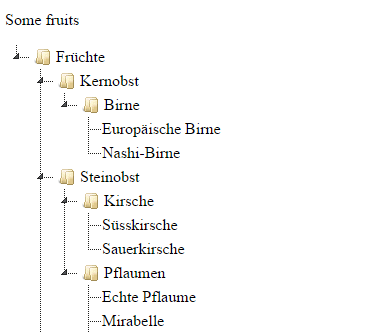

CSV to jsTree
=============

Generates a tree structure for [jsTree](http://www.jstree.com/) from a CSV file.
Copy the generated data into the HTML to see a result. This is a pragmatic solution for local testing, as a jQuery AJAX request for a .json-file would be blocked.

## How to use

  1. Run script to generate JSON from a CSV
  2. Copy JSON data into HTML to see tree

When running the script, the elements are generated as follows:

    { "id" : {id}, "parent" : {parent}, "text" : {text}}

with a optional `icon = false` if the node is a leaf node.

## Known Bugs
IDs of elements are strictly generated by name at the moment. If you have several nodes with the same names which are not leaf nodes, you might get some problems.

## License
For my own code, I chose the following license (folder `lib` not included):

The MIT License (MIT)

Copyright (c) 2015 Adrianus Kleemans

Permission is hereby granted, free of charge, to any person obtaining a copy
of this software and associated documentation files (the "Software"), to deal
in the Software without restriction, including without limitation the rights
to use, copy, modify, merge, publish, distribute, sublicense, and/or sell
copies of the Software, and to permit persons to whom the Software is
furnished to do so, subject to the following conditions:

The above copyright notice and this permission notice shall be included in all
copies or substantial portions of the Software.

THE SOFTWARE IS PROVIDED "AS IS", WITHOUT WARRANTY OF ANY KIND, EXPRESS OR
IMPLIED, INCLUDING BUT NOT LIMITED TO THE WARRANTIES OF MERCHANTABILITY,
FITNESS FOR A PARTICULAR PURPOSE AND NONINFRINGEMENT. IN NO EVENT SHALL THE
AUTHORS OR COPYRIGHT HOLDERS BE LIABLE FOR ANY CLAIM, DAMAGES OR OTHER
LIABILITY, WHETHER IN AN ACTION OF CONTRACT, TORT OR OTHERWISE, ARISING FROM,
OUT OF OR IN CONNECTION WITH THE SOFTWARE OR THE USE OR OTHER DEALINGS IN THE
SOFTWARE.
